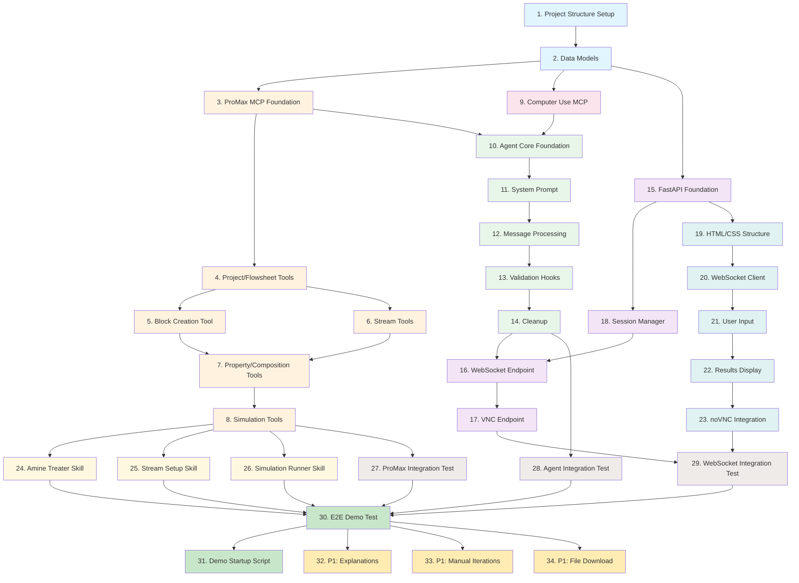

# ProcAgent MVP Implementation Plan

This implementation plan provides a phased, test-driven approach to building the ProcAgent MVP. Tasks are organized to deliver incremental value, with P0 (Must Demo) requirements prioritized first.

---

## Phase 1: Project Foundation and Core Infrastructure

- [ ] 1. Set up project structure and development environment
  - Create the procagent directory structure as defined in design (agent/, mcp/, cua/, server/, web/, skills/)
  - Initialize Python virtual environment and install core dependencies (fastapi, uvicorn, pywin32, websockets)
  - Create requirements.txt with all dependencies
  - Set up configuration module with settings.yaml for API keys and ports
  - Create basic logging infrastructure
  - _Requirements: Req 9.1 (single PC deployment), Req 9.2 (startup prerequisites)_

- [ ] 2. Create core data models and type definitions
  - Implement Pydantic models for ProcAgentSession, BlockIdentification, StreamSpec
  - Implement StreamProperties, PerformanceTarget, SimulationResult models
  - Implement ResultsComparison, TargetAssessment, AdjustmentSuggestion models
  - Implement WebSocket message models (ChatMessage, AgentResponse)
  - Write unit tests for model validation (composition sum validation, temperature range, pressure validation)
  - _Requirements: Req 2.9 (composition validation), Req 2.10 (property ordering)_

---

## Phase 2: ProMax MCP Server (COM API Integration)

- [ ] 3. Implement ProMax MCP Server foundation
  - Create promax_server.py with MCP server factory function
  - Implement COM connection state management (_state dictionary)
  - Implement _get_promax() helper for COM connection
  - Write mock-based unit tests for server initialization
  - _Requirements: Req 1.5 (COM API block creation), Req 2.6 (COM API for blocks/streams)_

- [ ] 4. Implement project and flowsheet management tools
  - [ ] 4.1 Implement create_project tool
    - Create new ProMax project via pmx.New()
    - Return structured MCP response with project name
    - Write unit tests with mocked COM objects
    - _Requirements: Req 2.1 (flowsheet creation)_

  - [ ] 4.2 Implement add_flowsheet tool
    - Add flowsheet to project via Flowsheets.Add()
    - Handle error case when no project exists
    - Write unit tests for success and error cases
    - _Requirements: Req 2.1 (flowsheet creation)_

  - [ ] 4.3 Implement add_components tool
    - Add chemical components to environment via env.Components.Add()
    - Track added and failed components
    - Return summary with success/failure counts
    - Write unit tests for component addition
    - _Requirements: Req 2.2 (component extraction), Req 2.3 (component addition), Req 2.4 (ProMax nomenclature)_

- [ ] 5. Implement block creation tool
  - Implement create_block tool with block type mapping (AmineTreater, Separator, HeatExchanger, etc.)
  - Map block types to Visio stencils and master shapes (Column.vss/Distill, Separators.vss, etc.)
  - Implement Visio shape drop at specified coordinates
  - Handle unknown block type error case
  - Write unit tests for block creation with mock Visio objects
  - _Requirements: Req 1.4 (block type mapping), Req 1.5 (COM API block creation)_

- [ ] 6. Implement stream creation and connection tools
  - [ ] 6.1 Implement create_stream tool
    - Drop Process Stream shape from Streams.vss stencil
    - Position stream at specified x,y coordinates
    - Set stream name
    - Write unit tests for stream creation
    - _Requirements: Req 1.6 (stream creation and connection)_

  - [ ] 6.2 Implement connect_stream tool
    - Connect stream to block port using Visio GlueTo
    - Handle inlet vs outlet connections (EndX vs BeginX)
    - Map port_index to Connections.X cell
    - Write unit tests for stream connection
    - _Requirements: Req 1.6 (stream creation and connection)_

- [ ] 7. Implement stream property and composition tools
  - [ ] 7.1 Implement set_stream_properties tool
    - Set temperature (C to K conversion)
    - Set pressure (kPa to Pa conversion)
    - Set molar flow (kmol/h to mol/s conversion)
    - Set mass flow (kg/h to kg/s conversion)
    - Write unit tests for unit conversions
    - _Requirements: Req 2.7 (prompt for inlet stream data), Req 2.8 (populate stream properties), Req 2.9 (property ordering)_

  - [ ] 7.2 Implement set_stream_composition tool
    - Validate composition sums to 1.0 (within 0.001 tolerance)
    - Build composition array matching environment component order
    - Set composition via SIValues tuple
    - Write unit tests for composition validation and setting
    - _Requirements: Req 2.10 (composition setting via SIValues)_

  - [ ] 7.3 Implement flash_stream tool
    - Call stream.Flash() to establish thermodynamic equilibrium
    - Write unit test for flash operation
    - _Requirements: Req 2.11 (flash streams)_

- [ ] 8. Implement simulation execution and results tools
  - [ ] 8.1 Implement run_simulation tool
    - Execute solver via flowsheet.Solver.Solve()
    - Interpret status code (>=1 converged, 0 not converged, <0 error)
    - Return convergence status message
    - Write unit tests for convergence scenarios
    - _Requirements: Req 3.1 (execute simulation), Req 3.2 (retrieve results)_

  - [ ] 8.2 Implement get_results tool
    - Retrieve temperature, pressure, molar flow for specified streams
    - Retrieve composition for specified streams
    - Handle multiple streams and properties in single call
    - Write unit tests for results retrieval
    - _Requirements: Req 3.2 (retrieve results), Req 3.3 (display results)_

  - [ ] 8.3 Implement save_project tool
    - Save project to specified file path via SaveAs()
    - Write unit test for project saving
    - _Requirements: Req 6.1 (save project), Req 6.2 (download link)_

---

## Phase 3: Computer Use MCP Server (Fallback Mechanism)

- [ ] 9. Implement Computer Use MCP Server
  - [ ] 9.1 Create computer_use_server.py with MCP server factory
    - Set up display configuration (width, height)
    - Write unit tests for server initialization
    - _Requirements: Req 1.9 (Computer Use fallback), Req 8.3 (fallback for COM failures)_

  - [ ] 9.2 Implement screenshot tool
    - Capture screen using mss library
    - Convert to PIL Image and resize if needed
    - Return base64 encoded PNG
    - Write unit tests with mocked screen capture
    - _Requirements: Req 1.9 (Computer Use fallback)_

  - [ ] 9.3 Implement click tool
    - Click at specified x,y coordinates
    - Support left/right/middle button
    - Support single/double click
    - Write unit tests with mocked pyautogui
    - _Requirements: Req 1.9 (Computer Use fallback)_

  - [ ] 9.4 Implement type and key tools
    - type tool: Type text at cursor position
    - key tool: Press single key or key combination (e.g., ctrl+s)
    - Write unit tests for text input and key presses
    - _Requirements: Req 1.9 (Computer Use fallback)_

  - [ ] 9.5 Implement move and scroll tools
    - move tool: Move mouse to coordinates
    - scroll tool: Scroll in specified direction
    - Write unit tests for mouse movement and scrolling
    - _Requirements: Req 1.9 (Computer Use fallback)_

---

## Phase 4: Claude Agent Core (Orchestrator)

- [ ] 10. Implement ProcAgentCore class foundation
  - Create core.py with ProcAgentCore class
  - Implement constructor accepting session_id, MCP servers, working_dir
  - Implement initialize() method to create ClaudeSDKClient with options
  - Configure MCP servers, allowed tools, system prompt
  - Set execution limits (max_turns=50, max_budget_usd=10.0)
  - Write unit tests with mocked ClaudeSDKClient
  - _Requirements: Req 4.1 (browser chat interface), Req 7.1 (3-second acknowledgment)_

- [ ] 11. Implement system prompt for ProMax operations
  - Build comprehensive system prompt with tool descriptions
  - Include workflow for Amine Treater demo (12-step process)
  - Include rules for COM API vs Computer Use selection
  - Include performance targets for demo scenario
  - Write tests to verify system prompt content
  - _Requirements: Req 1.1-1.4 (block identification), Req 2.15 (setup sequence)_

- [ ] 12. Implement user message processing
  - [ ] 12.1 Implement process_user_message async generator
    - Build prompt parts with optional image and stream data
    - Send query to Claude Agent SDK
    - Yield streaming responses (text, tool_use, result)
    - Write unit tests for message processing flow
    - _Requirements: Req 1.2 (PFD image upload), Req 4.2 (message acknowledgment)_

  - [ ] 12.2 Implement multimodal input handling
    - Accept PFD image as bytes and convert to base64
    - Include image in prompt for multimodal analysis
    - Include stream data JSON when provided
    - Write unit tests for multimodal input handling
    - _Requirements: Req 1.2 (PFD image interpretation), Req 1.3 (image + text combination)_

- [ ] 13. Implement tool validation hooks
  - [ ] 13.1 Implement composition validation hook
    - Validate composition sums to 1.0 before set_stream_composition
    - Return deny decision with reason if invalid
    - Write unit tests for validation hook
    - _Requirements: Req 2.10 (composition must sum to 1.0)_

  - [ ] 13.2 Implement property range validation hook
    - Validate temperature range (-273.15 to 1000 C)
    - Validate pressure is positive
    - Write unit tests for property validation
    - _Requirements: Req 2.9 (stream property setting)_

  - [ ] 13.3 Implement logging hooks
    - Log computer use tool invocations
    - Log tool results and detect errors
    - Insert system message on error for fallback guidance
    - Write unit tests for logging hooks
    - _Requirements: Req 4.3 (status indicators), Req 8.1 (error notification)_

- [ ] 14. Implement cleanup and resource management
  - Implement cleanup() method to close ClaudeSDKClient
  - Handle graceful shutdown of agent resources
  - Write unit tests for cleanup behavior
  - _Requirements: Req 9.4 (single user session handling)_

---

## Phase 5: Backend Server (FastAPI + WebSocket)

- [ ] 15. Implement FastAPI application foundation
  - Create app.py with FastAPI application
  - Configure CORS for localhost access
  - Mount static files directory for web assets
  - Implement root endpoint to serve index.html
  - Implement health check endpoint
  - Write unit tests for basic endpoints
  - _Requirements: Req 4.1 (browser-based interface), Req 9.1 (single PC deployment)_

- [ ] 16. Implement WebSocket chat endpoint
  - [ ] 16.1 Create WebSocket connection handler
    - Accept WebSocket connection
    - Generate unique session_id
    - Create session via SessionManager
    - Send session_created message to client
    - Write unit tests for connection handling
    - _Requirements: Req 4.1 (chat interface), Req 4.2 (message acknowledgment)_

  - [ ] 16.2 Implement chat message processing loop
    - Initialize ProcAgentCore with MCP servers
    - Parse incoming chat messages
    - Handle pfd_image base64 decoding
    - Stream responses back to client
    - Write unit tests for message loop
    - _Requirements: Req 4.2 (status updates), Req 4.3 (real-time status indicators)_

  - [ ] 16.3 Implement error handling and cleanup
    - Handle WebSocketDisconnect gracefully
    - Send error messages to client on exceptions
    - Clean up agent and session on disconnect
    - Write unit tests for error scenarios
    - _Requirements: Req 8.1 (error notification), Req 8.2 (unresponsive detection)_

- [ ] 17. Implement VNC connection endpoint
  - Create endpoint to return VNC connection info (host, port, password)
  - Handle session not found error
  - Write unit tests for VNC info endpoint
  - _Requirements: Req 4.4 (VNC streaming), Req 4.6 (websockify proxy)_

---

## Phase 6: Session Management

- [ ] 18. Implement SessionManager class
  - [ ] 18.1 Create Session dataclass and SessionManager foundation
    - Define Session with session_id, vnc_port, vnc_password, working_dir
    - Implement SessionManager with configurable base_vnc_port, max_sessions, timeout
    - Write unit tests for SessionManager initialization
    - _Requirements: Req 9.4 (single user session), Req 4.4 (fixed VNC port)_

  - [ ] 18.2 Implement create_session method
    - Check max_sessions limit
    - Allocate VNC port (use fixed port 5900 for MVP)
    - Create working directory for session
    - Note: TightVNC expected to be pre-running (no spawn)
    - Return Session object
    - Write unit tests for session creation
    - _Requirements: Req 4.5 (pre-running TightVNC), Req 9.2 (TightVNC running)_

  - [ ] 18.3 Implement destroy_session method
    - Remove session from active sessions
    - Terminate ProMax process if running
    - Optionally clean up working directory
    - Write unit tests for session destruction
    - _Requirements: Req 9.4 (session cleanup)_

  - [ ] 18.4 Implement session timeout monitoring
    - Start async task to monitor session timeout
    - Destroy session after timeout period
    - Write unit tests for timeout behavior
    - _Requirements: Req 9.4 (session lifecycle)_

---

## Phase 7: Web Frontend

- [ ] 19. Implement HTML/CSS structure for chat interface
  - Create index.html with header, main container, chat panel, VNC panel layout
  - Style message bubbles (user, assistant, tool)
  - Style input area with text input, send button, upload button
  - Style results panel with pass/fail indicators
  - Ensure responsive layout for 1280x720 minimum
  - _Requirements: Req 4.1 (browser-based chat), Req 4.8 (1280x720 minimum), Req 4.9 (modern browser support)_

- [ ] 20. Implement WebSocket communication
  - [ ] 20.1 Implement connect() function
    - Create WebSocket connection to /ws endpoint
    - Handle onopen, onclose, onerror events
    - Update status badge based on connection state
    - Implement auto-reconnect on disconnect
    - _Requirements: Req 4.1 (chat interface), Req 7.1 (3-second acknowledgment)_

  - [ ] 20.2 Implement message handling
    - Parse incoming JSON messages
    - Handle session_created (set sessionId, connect noVNC)
    - Handle text (display assistant message)
    - Handle tool_use (display tool invocation)
    - Handle results (display results table)
    - Handle error (display error message)
    - _Requirements: Req 4.2 (status updates), Req 4.3 (real-time status indicators)_

- [ ] 21. Implement user input handling
  - [ ] 21.1 Implement sendMessage() function
    - Get message from input field
    - Add user message to chat display
    - Send chat message via WebSocket
    - Clear input field
    - _Requirements: Req 4.1 (chat input)_

  - [ ] 21.2 Implement file upload handling
    - Handle file input change event
    - Read file as base64 using FileReader
    - Send chat message with pfd_image attachment
    - Display upload confirmation in chat
    - _Requirements: Req 1.2 (PFD image upload)_

- [ ] 22. Implement results display
  - Create displayResults() function
  - Build HTML table with parameter, target, actual, status columns
  - Apply pass/fail styling based on overall result
  - Display suggestions if targets not met
  - _Requirements: Req 3.3 (display results), Req 3.4 (pass/fail status), Req 3.5 (suggestions)_

- [ ] 23. Integrate noVNC viewer
  - Add iframe for noVNC viewer
  - Set iframe src to VNC WebSocket path on session creation
  - Style VNC panel for proper display
  - _Requirements: Req 4.4 (VNC streaming), Req 4.6 (noVNC via websockify), Req 4.7 (5 fps minimum)_

---

## Phase 8: Claude Skills (Workflow Templates)

- [ ] 24. Create Amine Treater skill
  - Create skills/promax-amine-treater/SKILL.md
  - Document required components (MDEA, H2S, CO2, Water, hydrocarbons)
  - Document block creation steps (Distill from Column.vss)
  - Document stream configuration (4 ports: Sour Gas, Lean Amine, Treated Gas, Rich Amine)
  - Document typical operating conditions and performance targets
  - _Requirements: Req 1.4 (block type mapping), Req 3.4 (performance targets)_

- [ ] 25. Create Stream Setup skill
  - Create skills/promax-stream-setup/SKILL.md
  - Document property setting order (T, P, flow, composition, flash)
  - Document composition rules (sum to 1.0, normalize if needed)
  - Document common errors and solutions
  - _Requirements: Req 2.15 (setup sequence), Req 2.10 (composition rules)_

- [ ] 26. Create Simulation Runner skill
  - Create skills/promax-simulation-runner/SKILL.md
  - Document pre-simulation checklist
  - Document status code interpretation
  - Document result comparison methodology
  - Document common convergence issues
  - _Requirements: Req 3.1-3.5 (simulation execution and results)_

---

## Phase 9: Integration Testing

- [ ] 27. Create integration test for ProMax MCP Server
  - Write test with real ProMax COM connection (skip if ProMax unavailable)
  - Test full workflow: create project, add flowsheet, add components, create block
  - Test stream creation and connection
  - Test property setting and composition
  - Test simulation execution
  - _Requirements: Req 1.5, Req 2.6 (COM API operations)_

- [ ] 28. Create integration test for Claude Agent Core
  - Write test with mocked LLM responses
  - Test message processing with PFD image
  - Test tool invocation flow
  - Test results comparison
  - _Requirements: Req 1.1-1.8 (block creation flow)_

- [ ] 29. Create integration test for WebSocket communication
  - Write test for WebSocket connection and message exchange
  - Test session creation and cleanup
  - Test error handling scenarios
  - _Requirements: Req 4.1-4.3 (UI communication)_

---

## Phase 10: End-to-End Demo Testing

- [ ] 30. Create E2E test script for Amine Treater demo
  - Implement test_amine_treater_demo.py
  - Test block creation from chat description
  - Test parameter population with sample stream data
  - Test simulation execution and results comparison
  - Test target assessment and suggestions
  - Run manually with actual ProMax installation
  - _Requirements: All P0 requirements (Req 1, 2, 3, 4)_

- [ ] 31. Create demo startup script and documentation
  - Create run_demo.py or run_demo.ps1 startup script
  - Check prerequisites (ProMax, TightVNC, API key)
  - Start FastAPI server on configured port
  - Open browser to localhost
  - Document manual setup steps in README
  - _Requirements: Req 9.2 (startup procedure), Req 9.3 (no cloud services)_

---

## Phase 11: P1 Features (If Time Permits)

- [ ] 32. Implement basic explanations for results (P1)
  - [ ] 32.1 Add explanation generation for failed targets
    - Analyze which parameters missed targets
    - Generate brief explanation of likely causes
    - Include in results response
    - _Requirements: Req 5.1 (explanation of causes)_

  - [ ] 32.2 Add rationale for parameter suggestions
    - Explain why each suggested adjustment should help
    - Include expected impact description
    - _Requirements: Req 5.2 (explain adjustments)_

- [ ] 33. Implement manual iteration support (P1)
  - [ ] 33.1 Enable parameter adjustment re-runs
    - Accept user request to adjust parameters
    - Apply changes via COM API
    - Re-run simulation
    - _Requirements: Req 3.6 (apply parameter changes)_

  - [ ] 33.2 Display run comparison
    - Track current vs previous run results
    - Show improvement or degradation
    - _Requirements: Req 3.7 (display comparison)_

- [ ] 34. Implement file download capability (P1)
  - Add download endpoint for .prx files
  - Generate clear file names with project identifier
  - Add download button to UI
  - _Requirements: Req 6.1-6.3 (file export and download)_

---

## Tasks Dependency Diagram

**Legend:**
- Blue (#e1f5fe): Phase 1 - Foundation
- Orange (#fff3e0): Phase 2 - ProMax MCP Server
- Pink (#fce4ec): Phase 3 - Computer Use MCP
- Green (#e8f5e9): Phase 4 - Agent Core
- Purple (#f3e5f5): Phase 5-6 - Backend Server & Session
- Teal (#e0f2f1): Phase 7 - Web Frontend
- Yellow (#fff8e1): Phase 8 - Skills
- Brown (#efebe9): Phase 9 - Integration Tests
- Light Green (#c8e6c9): Phase 10 - E2E Testing
- Amber (#ffecb3): Phase 11 - P1 Features
