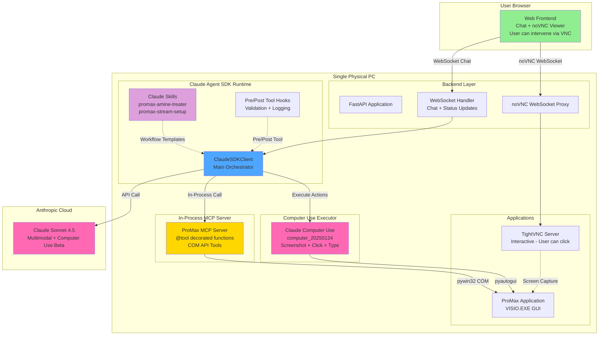
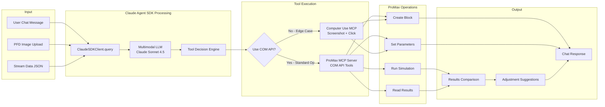
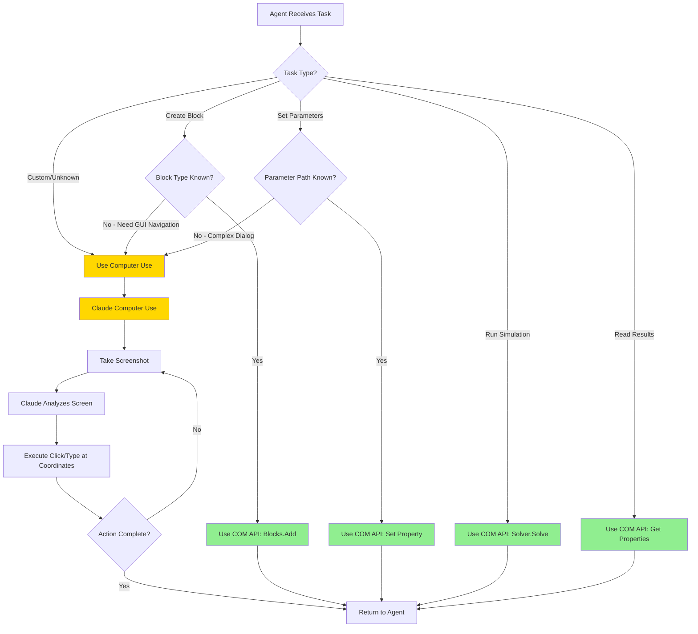
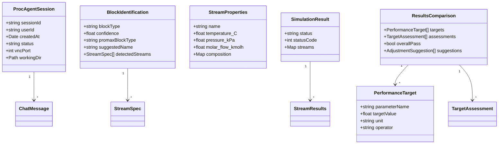
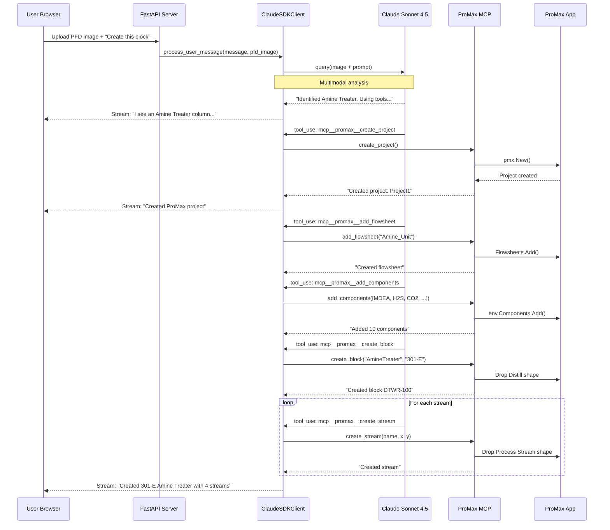
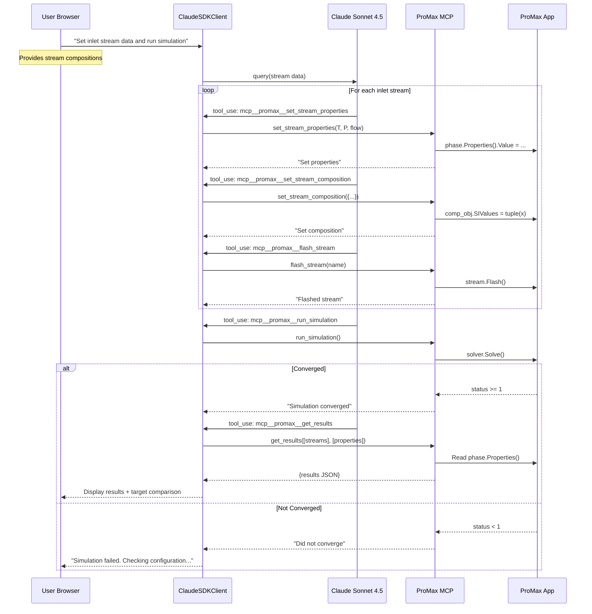
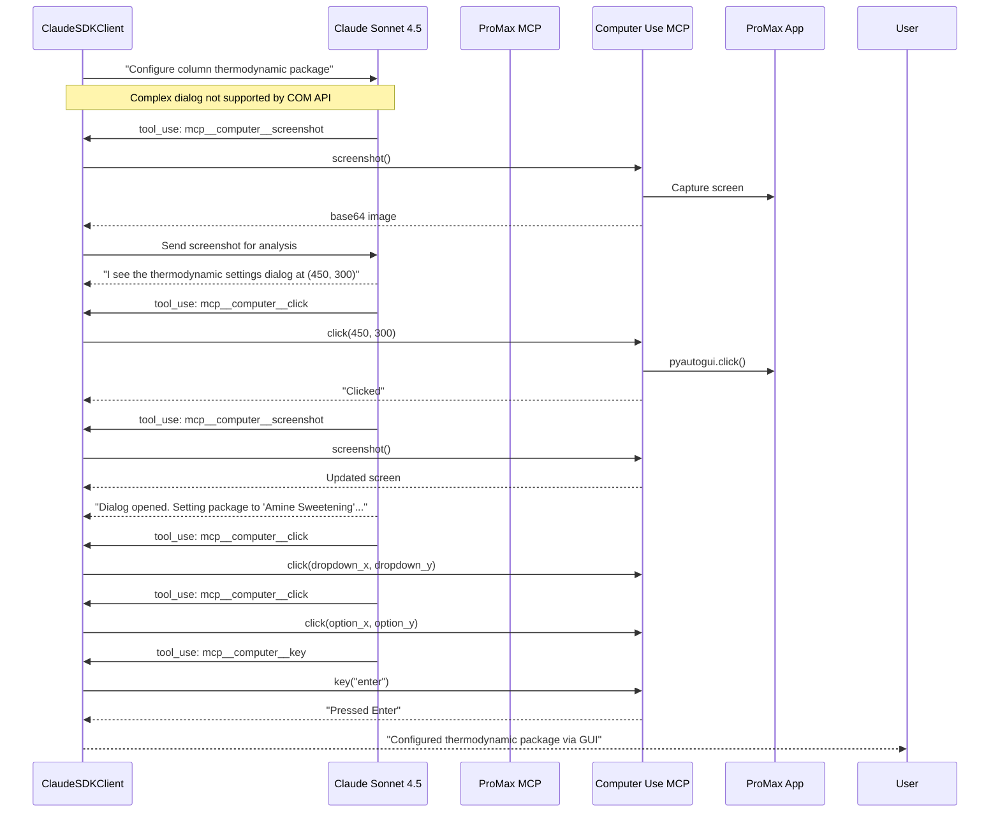
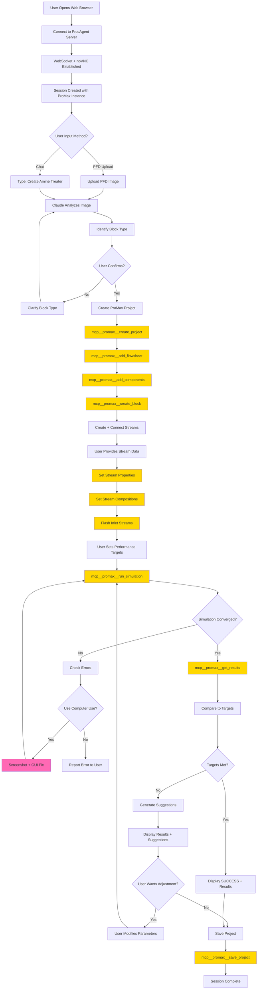
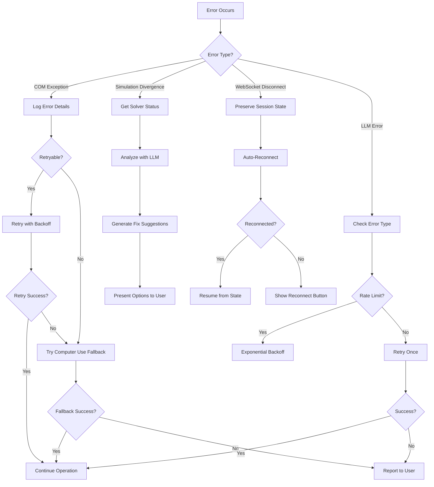

# ProcAgent Design Document (MVP v3)

## Overview

ProcAgent is an AI copilot for chemical process simulation using ProMax. Built on the **Claude Agent SDK** (`pip install claude-agent-sdk`), ProcAgent delivers a web-based SaaS application where users interact via a browser-based chat interface while ProMax runs on the same physical PC.

**MVP Architecture Philosophy:** Single-PC deployment with Claude Agent SDK as the central orchestrator, ProMax COM API as the primary execution mechanism, TightVNC for interactive visual monitoring (user can intervene), and Claude's native Computer Use tool (`computer_20250124`) as the fallback for edge cases. **Claude Skills** provide reusable workflow templates for common ProMax operations.

### Design Goals (MVP)

1. **Single Block Creation**: Create ONE ProMax block via PFD upload with highlighting OR chat description
2. **Parameter Population**: Fill block parameters from user-provided inlet stream data
3. **Simulation Execution**: Run simulation, display results, compare to targets, suggest adjustments
4. **Browser-Based UI**: Chat interface with live TightVNC streaming (user can click/intervene)
5. **Intelligent Fallback**: Seamless transition from COM API to Claude Computer Use when needed
6. **Skill-Based Workflows**: Reusable Claude Skills for common ProMax operations

### Key Architecture Decisions

| Decision | Choice | Rationale |
|----------|--------|-----------|
| Agent Framework | Claude Agent SDK (`pip install claude-agent-sdk`) | Official Anthropic SDK with in-process MCP servers, hooks, streaming |
| Primary ProMax Control | ProMax COM API via pywin32 | Reliable, efficient, deterministic programmatic control |
| Visual Monitoring | TightVNC + noVNC (interactive) | User can view AND click/intervene in ProMax directly |
| Fallback Mechanism | Claude Computer Use (`computer_20250124`) | Native Anthropic tool for coordinate-based screen interactions |
| Backend Server | FastAPI + WebSocket | Industry standard, async support |
| Tool Definition | In-Process MCP Server | SDK-native `@tool` decorator, no subprocess overhead |
| Workflow Templates | Claude Skills | Reusable SKILL.md files for ProMax operations |
| Deployment (MVP) | Single Physical PC | Simplified setup - no VM required for MVP demo |

### New Standalone Repo Structure

This will be a **new standalone repository** (not a UFO module). Useful code from UFO can be copied/adapted.

```
procagent/                    # NEW standalone repository
├── procagent/
│   ├── agent/
│   │   └── core.py           # ClaudeSDKClient orchestrator
│   ├── mcp/
│   │   └── promax_server.py  # In-process MCP with @tool decorators
│   ├── cua/
│   │   └── computer_use.py   # Claude Computer Use tool executor
│   ├── server/
│   │   └── app.py            # FastAPI backend
│   ├── web/
│   │   └── index.html        # Chat + noVNC frontend
│   └── skills/               # Claude Skills for ProMax workflows
│       ├── promax-amine-treater/
│       │   └── SKILL.md
│       ├── promax-separator/
│       │   └── SKILL.md
│       └── promax-stream-setup/
│           └── SKILL.md
├── config/
│   └── settings.yaml
├── tests/
└── requirements.txt
```

**Reuse from UFO:** Copy useful COM API patterns from `ufo/client/mcp/local_servers/promax_com_mcp_server.py`.

---

## Architecture Design

### System Architecture Diagram (MVP - Single PC)



**Legend:**
- Green: User-facing components
- Blue: Claude Agent SDK orchestrator
- Gold: In-Process MCP Tool Server
- Pink: Computer Use / AI Service
- Purple: Claude Skills (workflow templates)

### Data Flow Diagram



### Decision Flow: COM API vs Computer Use



---

## Component Design

### Components Overview

| Component | Type | Technology | Description |
|-----------|------|------------|-------------|
| Web Frontend | NEW | HTML/JS + noVNC | Chat interface + embedded VNC viewer (interactive) |
| Backend Server | NEW | FastAPI + WebSocket | API gateway, VNC proxy (single-PC deployment) |
| Claude Agent Core | NEW | Claude Agent SDK | Main orchestrator using ClaudeSDKClient |
| ProMax MCP Server | NEW | In-Process MCP + pywin32 | COM API tools using @tool decorator |
| Computer Use Executor | NEW | pyautogui + mss | Execute Claude's computer_20250124 tool actions |
| Claude Skills | NEW | SKILL.md files | Workflow templates for common ProMax operations |
| Session Manager | NEW | Python | Session lifecycle (simplified for MVP) |

---

## Claude Skills for ProMax

Claude Skills are reusable workflow templates that teach Claude how to complete ProMax-specific tasks. Skills are loaded dynamically (~100 tokens for scanning, <5k when activated).

### Skill: promax-amine-treater

**Location:** `procagent/skills/promax-amine-treater/SKILL.md`

```markdown
---
name: promax-amine-treater
description: Create and configure an Amine Treater (absorber column) for H2S/CO2 removal in ProMax
---

# Amine Treater Creation Skill

Use this skill when the user wants to create an amine treater, absorber, or acid gas removal column.

## Required Components
Add these components to the flowsheet environment:
- MDEA (or DEA, MEA depending on user spec)
- Water
- Hydrogen Sulfide
- Carbon Dioxide
- Methane, Ethane, Propane (hydrocarbon feed)
- n-Butane, Isobutane, n-Pentane (heavier hydrocarbons if present)

## Block Creation Steps
1. Use `mcp__promax__create_block` with block_type="AmineTreater"
2. This drops a "Distill" shape from Column.vss stencil
3. Default name will be DTWR-100 or similar

## Stream Configuration
Create these streams and connect to block:
| Stream | Type | Port | Description |
|--------|------|------|-------------|
| Sour Gas | Inlet | 5 (Bottom Left) | Feed gas containing H2S/CO2 |
| Lean Amine | Inlet | 3 (Top Left) | Regenerated amine solution |
| Treated Gas | Outlet | 4 (Top Right) | Sweet gas product |
| Rich Amine | Outlet | 6 (Bottom Right) | Amine loaded with acid gas |

## Typical Operating Conditions
- Column: 10-20 theoretical stages
- Sour gas inlet: 30-60°C, 500-1000 kPa
- Lean amine inlet: 40-55°C, slightly above column pressure
- Amine concentration: 30-50 wt% MDEA in water

## Performance Targets
- Treated gas H2S: ≤100 ppm (typical spec)
- Treated gas CO2: ≤2 mol% (typical spec)
- Rich amine loading: ≤0.45 mol acid gas/mol amine
```

### Skill: promax-stream-setup

**Location:** `procagent/skills/promax-stream-setup/SKILL.md`

```markdown
---
name: promax-stream-setup
description: Set up process streams with properties and compositions in ProMax
---

# Stream Setup Skill

Use this skill when configuring stream properties and compositions.

## Property Setting Order
ALWAYS follow this sequence:
1. Set temperature (°C → convert to K internally)
2. Set pressure (kPa → convert to Pa internally)
3. Set flow rate (kmol/h or kg/h)
4. Set composition (mole fractions, MUST sum to 1.0)
5. Flash the stream

## Composition Rules
- All mole fractions MUST sum to exactly 1.0
- If user provides mass fractions, convert to molar
- Normalize if sum is close but not exact

## Flash Requirements
ALWAYS flash inlet streams after setting composition:
```
mcp__promax__flash_stream(stream_name)
```
This establishes thermodynamic equilibrium.

## Common Errors
- Composition not summing to 1.0 → normalize values
- Missing flash → stream properties undefined
- Wrong component names → check exact ProMax names
```

### Skill: promax-simulation-runner

**Location:** `procagent/skills/promax-simulation-runner/SKILL.md`

```markdown
---
name: promax-simulation-runner
description: Run ProMax simulations and interpret results
---

# Simulation Runner Skill

Use this skill when running simulations and checking convergence.

## Pre-Simulation Checklist
Before running solver:
- [ ] All inlet streams have T, P, flow defined
- [ ] All inlet compositions set and sum to 1.0
- [ ] All inlet streams flashed
- [ ] Block connections verified

## Running Simulation
```
mcp__promax__run_simulation()
```

## Interpreting Results
| Status Code | Meaning | Action |
|-------------|---------|--------|
| ≥1 | Converged | Read results |
| 0 | Not converged | Check specifications |
| <0 | Error | Check error messages |

## Result Comparison
When comparing to targets:
1. Get results for outlet streams
2. Compare each parameter to target
3. Calculate deviation percentage
4. Suggest adjustments if targets not met

## Common Convergence Issues
- Missing specifications → add T, P, or flow
- Infeasible conditions → check thermodynamic validity
- Component missing → verify all species added
```

### Skills Integration in Agent

The ClaudeSDKClient automatically loads skills from the skills directory:

```python
options = ClaudeAgentOptions(
    # ... other options ...

    # Skills directory - Claude auto-loads relevant skills
    skills_dir=Path("procagent/skills"),

    # Skills are invoked automatically based on task context
    # No manual activation needed
)
```

### Component 1: Claude Agent Core

**Location:** `procagent/agent/core.py`

**Responsibilities:**
- Orchestrate all interactions using ClaudeSDKClient
- Route tasks to appropriate MCP tools
- Handle multimodal inputs (PFD images + text)
- Manage conversation state across turns
- Apply pre/post tool hooks for validation

**Implementation using Claude Agent SDK:**

```python
import asyncio
from claude_agent_sdk import (
    ClaudeSDKClient,
    ClaudeAgentOptions,
    tool,
    create_sdk_mcp_server,
    HookMatcher,
    AssistantMessage,
    TextBlock,
    ToolUseBlock,
    ResultMessage
)
from typing import Dict, Any, Optional
from pathlib import Path

class ProcAgentCore:
    """Core orchestrator using Claude Agent SDK."""

    def __init__(
        self,
        session_id: str,
        promax_mcp_server,
        cua_mcp_server,
        working_dir: Path
    ):
        self.session_id = session_id
        self.promax_mcp = promax_mcp_server
        self.cua_mcp = cua_mcp_server
        self.working_dir = working_dir
        self.client: Optional[ClaudeSDKClient] = None

    async def initialize(self):
        """Initialize the Claude Agent SDK client."""
        options = ClaudeAgentOptions(
            # MCP servers for tools
            mcp_servers={
                "promax": self.promax_mcp,
                "computer": self.cua_mcp
            },

            # Allowed tools
            allowed_tools=[
                # ProMax COM API tools
                "mcp__promax__create_project",
                "mcp__promax__add_flowsheet",
                "mcp__promax__add_components",
                "mcp__promax__create_block",
                "mcp__promax__create_stream",
                "mcp__promax__connect_stream",
                "mcp__promax__set_stream_properties",
                "mcp__promax__set_stream_composition",
                "mcp__promax__flash_stream",
                "mcp__promax__run_simulation",
                "mcp__promax__get_results",
                "mcp__promax__save_project",
                # Computer Use fallback tools
                "mcp__computer__screenshot",
                "mcp__computer__click",
                "mcp__computer__type",
                "mcp__computer__key"
            ],

            # System prompt
            system_prompt=self._build_system_prompt(),

            # Execution limits
            max_turns=50,
            max_budget_usd=10.0,

            # Model selection - Claude Sonnet 4.5 for computer use
            model="claude-sonnet-4-5",

            # Working directory
            cwd=self.working_dir,

            # Hooks for validation and logging
            hooks={
                "PreToolUse": [
                    HookMatcher(matcher="mcp__promax__", hooks=[self._validate_promax_tool]),
                    HookMatcher(matcher="mcp__computer__", hooks=[self._log_computer_use])
                ],
                "PostToolUse": [
                    HookMatcher(matcher=None, hooks=[self._log_tool_result])
                ]
            },

            # Enable partial messages for streaming
            include_partial_messages=True
        )

        self.client = ClaudeSDKClient(options=options)
        await self.client.__aenter__()

    async def process_user_message(
        self,
        message: str,
        pfd_image: Optional[bytes] = None,
        stream_data: Optional[Dict] = None
    ) -> AsyncIterator[Dict[str, Any]]:
        """Process a user message and yield responses."""
        # Build the prompt with optional image
        prompt_parts = []

        if pfd_image:
            # Include image for multimodal analysis
            prompt_parts.append({
                "type": "image",
                "source": {
                    "type": "base64",
                    "media_type": "image/png",
                    "data": base64.b64encode(pfd_image).decode()
                }
            })

        if stream_data:
            prompt_parts.append({
                "type": "text",
                "text": f"Stream data provided:\n{json.dumps(stream_data, indent=2)}"
            })

        prompt_parts.append({
            "type": "text",
            "text": message
        })

        # Send to Claude Agent SDK
        await self.client.query(prompt_parts if len(prompt_parts) > 1 else message)

        # Stream responses
        async for msg in self.client.receive_response():
            if isinstance(msg, AssistantMessage):
                for block in msg.content:
                    if isinstance(block, TextBlock):
                        yield {
                            "type": "text",
                            "content": block.text
                        }
                    elif isinstance(block, ToolUseBlock):
                        yield {
                            "type": "tool_use",
                            "tool": block.name,
                            "input": block.input
                        }
            elif isinstance(msg, ResultMessage):
                yield {
                    "type": "result",
                    "cost_usd": msg.total_cost_usd,
                    "input_tokens": msg.usage.input_tokens,
                    "output_tokens": msg.usage.output_tokens
                }

    def _build_system_prompt(self) -> str:
        """Build the system prompt for ProMax operations."""
        return """You are ProcAgent, an AI copilot for chemical process simulation using ProMax.

## Your Role
Help junior chemical engineers create and run process simulations in ProMax.
You have access to two types of tools:

### Primary Tools (ProMax COM API)
Use these MCP tools for standard operations:
- mcp__promax__create_project: Create a new ProMax project
- mcp__promax__add_flowsheet: Add a flowsheet to the project
- mcp__promax__add_components: Add chemical components to the environment
- mcp__promax__create_block: Create equipment blocks (Amine Treater, Separator, etc.)
- mcp__promax__create_stream: Create process streams
- mcp__promax__connect_stream: Connect streams to block inlet/outlet ports
- mcp__promax__set_stream_properties: Set T, P, flow rate
- mcp__promax__set_stream_composition: Set component mole fractions
- mcp__promax__flash_stream: Flash a stream to establish equilibrium
- mcp__promax__run_simulation: Execute the simulation solver
- mcp__promax__get_results: Retrieve simulation results
- mcp__promax__save_project: Save the project file

### Fallback Tools (Computer Use)
Only use these when COM API tools cannot accomplish a task:
- mcp__computer__screenshot: Capture current ProMax screen
- mcp__computer__click: Click at screen coordinates
- mcp__computer__type: Type text at current cursor
- mcp__computer__key: Press keyboard keys

## Workflow for Amine Treater Demo

1. **Analyze PFD Image**: If user uploads a PFD, analyze it to identify the highlighted block
2. **Create Project**: Use create_project and add_flowsheet tools
3. **Add Components**: Add all required chemical species (MDEA, H2S, CO2, Water, Methane, etc.)
4. **Create Block**: Create the Amine Treater (Staged Column) block
5. **Create Streams**: Create inlet (Sour Offgas, Lean Amine) and outlet streams
6. **Connect Streams**: Connect streams to appropriate block ports
7. **Set Properties**: Set stream T, P, flow rate
8. **Set Compositions**: Set mole fractions (must sum to 1.0)
9. **Flash Streams**: Flash inlet streams to establish equilibrium
10. **Run Simulation**: Execute solver and check convergence
11. **Get Results**: Retrieve outlet stream properties
12. **Compare to Targets**: Check if H2S <= 100 ppm, loading <= 0.45

## Important Rules

1. ALWAYS use COM API tools first - they are faster and more reliable
2. Only use Computer Use tools when COM API fails or for operations not supported by COM
3. When setting stream compositions, values MUST sum to 1.0
4. ALWAYS flash streams after setting composition
5. ALWAYS check simulation convergence before reading results
6. Explain what you are doing to help the user learn

## Performance Targets (Amine Treater Demo)
- Offgas H2S: <= 100 ppm(mol)
- Rich Amine Loading: <= 0.45 mol H2S/mol amine
"""

    async def _validate_promax_tool(self, input_data, tool_use_id, context):
        """Pre-tool hook to validate ProMax operations."""
        tool_name = input_data["tool_name"]
        tool_input = input_data["tool_input"]

        # Validate composition sums to 1.0
        if tool_name == "mcp__promax__set_stream_composition":
            composition = tool_input.get("composition", {})
            total = sum(composition.values())
            if abs(total - 1.0) > 0.001:
                return {
                    "hookSpecificOutput": {
                        "hookEventName": "PreToolUse",
                        "permissionDecision": "deny",
                        "permissionDecisionReason": f"Composition must sum to 1.0, got {total}"
                    }
                }

        return {}

    async def _log_computer_use(self, input_data, tool_use_id, context):
        """Pre-tool hook to log computer use (for monitoring)."""
        tool_name = input_data["tool_name"]
        tool_input = input_data["tool_input"]
        print(f"[CUA] Using {tool_name}: {tool_input}")
        return {}

    async def _log_tool_result(self, input_data, tool_use_id, context):
        """Post-tool hook to log results."""
        tool_response = input_data.get("tool_response", "")
        if "error" in str(tool_response).lower():
            return {
                "systemMessage": "Tool execution encountered an error. Consider using fallback approach."
            }
        return {}

    async def cleanup(self):
        """Clean up resources."""
        if self.client:
            await self.client.__aexit__(None, None, None)
```

### Component 2: ProMax MCP Server

**Location:** `procagent/mcp/promax_server.py`

**Responsibilities:**
- Provide structured MCP tools for ProMax COM API operations
- Handle pywin32 COM connections
- Implement all standard ProMax operations (create, set, run, get)
- Return structured results for the agent

**Implementation:**

```python
import win32com.client
from win32com.client import gencache
from claude_agent_sdk import tool, create_sdk_mcp_server
from typing import Dict, List, Any, Optional
import json

# ProMax COM Constants
pmxTotalPhase = 5
pmxPhaseTemperature = 0
pmxPhasePressure = 1
pmxPhaseMolarFlow = 16
pmxPhaseMassFlow = 17
pmxMolarFracBasis = 6
pmxStagedColumnBlock = 15

def create_promax_mcp_server():
    """Create ProMax MCP server with COM API tools."""

    # ProMax connection state
    _state = {
        "pmx": None,
        "project": None,
        "flowsheet": None
    }

    def _get_promax():
        """Get or create ProMax COM connection."""
        if _state["pmx"] is None:
            _state["pmx"] = gencache.EnsureDispatch('ProMax.ProMaxOutOfProc')
        return _state["pmx"]

    @tool(
        "create_project",
        "Create a new ProMax project",
        {}
    )
    async def create_project(args: Dict[str, Any]) -> Dict[str, Any]:
        """Create a new ProMax project."""
        pmx = _get_promax()
        _state["project"] = pmx.New()
        return {
            "content": [{
                "type": "text",
                "text": f"Created project: {_state['project'].Name}"
            }]
        }

    @tool(
        "add_flowsheet",
        "Add a flowsheet to the current project",
        {"name": str}
    )
    async def add_flowsheet(args: Dict[str, Any]) -> Dict[str, Any]:
        """Add a flowsheet to the project."""
        if _state["project"] is None:
            return {
                "content": [{"type": "text", "text": "Error: No project open"}],
                "is_error": True
            }
        name = args["name"]
        _state["flowsheet"] = _state["project"].Flowsheets.Add(name)
        return {
            "content": [{
                "type": "text",
                "text": f"Created flowsheet: {name}"
            }]
        }

    @tool(
        "add_components",
        "Add chemical components to the flowsheet environment",
        {"components": list}  # List of component names
    )
    async def add_components(args: Dict[str, Any]) -> Dict[str, Any]:
        """Add components to the thermodynamic environment."""
        if _state["flowsheet"] is None:
            return {
                "content": [{"type": "text", "text": "Error: No flowsheet"}],
                "is_error": True
            }

        env = _state["flowsheet"].Environment
        components = args["components"]
        added = []
        failed = []

        for comp in components:
            try:
                env.Components.Add(comp)
                added.append(comp)
            except Exception as e:
                failed.append(f"{comp}: {str(e)}")

        result = f"Added components: {', '.join(added)}"
        if failed:
            result += f"\nFailed: {', '.join(failed)}"

        return {
            "content": [{"type": "text", "text": result}]
        }

    @tool(
        "create_block",
        "Create an equipment block in the flowsheet",
        {
            "block_type": str,  # "AmineTreater", "Separator", etc.
            "name": str
        }
    )
    async def create_block(args: Dict[str, Any]) -> Dict[str, Any]:
        """Create a block in the flowsheet using Visio shape drop."""
        if _state["flowsheet"] is None:
            return {
                "content": [{"type": "text", "text": "Error: No flowsheet"}],
                "is_error": True
            }

        block_type = args["block_type"]
        name = args["name"]

        # Get Visio objects
        pmx = _get_promax()
        visio = pmx.VisioApp
        vpage = _state["flowsheet"].VisioPage

        # Map block type to stencil and master
        block_map = {
            "AmineTreater": ("Column.vss", "Distill"),
            "Separator": ("Separators.vss", "2 Phase Separator - Vertical"),
            "HeatExchanger": ("Exchangers.vss", "Shell and Tube Exchanger"),
            "Compressor": ("Fluid Drivers.vss", "Compressor"),
            "Pump": ("Fluid Drivers.vss", "Centrifugal Pump"),
            "JTValve": ("Valves.vss", "JT Valve")
        }

        if block_type not in block_map:
            return {
                "content": [{
                    "type": "text",
                    "text": f"Error: Unknown block type '{block_type}'. Available: {list(block_map.keys())}"
                }],
                "is_error": True
            }

        stencil_name, master_name = block_map[block_type]

        # Find stencil
        stencils = {}
        for i in range(1, visio.Documents.Count + 1):
            doc = visio.Documents(i)
            if doc.Type == 2:  # Stencil
                stencils[doc.Name] = doc

        if stencil_name not in stencils:
            return {
                "content": [{"type": "text", "text": f"Error: Stencil '{stencil_name}' not found"}],
                "is_error": True
            }

        # Drop shape
        master = stencils[stencil_name].Masters(master_name)
        shape = vpage.Drop(master, 5, 5)  # Center position

        # Get ProMax block name
        block = _state["flowsheet"].Blocks(0)  # Just created
        promax_name = block.Name

        return {
            "content": [{
                "type": "text",
                "text": f"Created {block_type} block: {promax_name} (requested name: {name})"
            }]
        }

    @tool(
        "create_stream",
        "Create a process stream",
        {
            "name": str,
            "x": float,  # Visio X coordinate
            "y": float   # Visio Y coordinate
        }
    )
    async def create_stream(args: Dict[str, Any]) -> Dict[str, Any]:
        """Create a process stream using Visio shape drop."""
        if _state["flowsheet"] is None:
            return {
                "content": [{"type": "text", "text": "Error: No flowsheet"}],
                "is_error": True
            }

        name = args["name"]
        x = args.get("x", 2)
        y = args.get("y", 5)

        pmx = _get_promax()
        visio = pmx.VisioApp
        vpage = _state["flowsheet"].VisioPage

        # Find Streams stencil
        stencils = {}
        for i in range(1, visio.Documents.Count + 1):
            doc = visio.Documents(i)
            if doc.Type == 2:
                stencils[doc.Name] = doc

        master = stencils['Streams.vss'].Masters('Process Stream')
        shape = vpage.Drop(master, x, y)
        shape.Name = name

        return {
            "content": [{
                "type": "text",
                "text": f"Created stream: {name} at ({x}, {y})"
            }]
        }

    @tool(
        "connect_stream",
        "Connect a stream to a block port",
        {
            "stream_name": str,
            "block_name": str,
            "port_type": str,  # "inlet" or "outlet"
            "port_index": int  # 1-based connection point index
        }
    )
    async def connect_stream(args: Dict[str, Any]) -> Dict[str, Any]:
        """Connect a stream to a block using Visio GlueTo."""
        if _state["flowsheet"] is None:
            return {
                "content": [{"type": "text", "text": "Error: No flowsheet"}],
                "is_error": True
            }

        stream_name = args["stream_name"]
        block_name = args["block_name"]
        port_type = args["port_type"]
        port_index = args["port_index"]

        # Get stream and block
        stream = _state["flowsheet"].PStreams(stream_name)
        block = _state["flowsheet"].Blocks(block_name)

        # Get Visio shapes
        stream_shape = stream.VShape
        block_shape = block.VShape

        # Connect using GlueTo
        if port_type == "inlet":
            # Stream END connects to block
            stream_shape.Cells("EndX").GlueTo(
                block_shape.Cells(f"Connections.X{port_index}")
            )
        else:
            # Stream BEGIN connects from block
            stream_shape.Cells("BeginX").GlueTo(
                block_shape.Cells(f"Connections.X{port_index}")
            )

        return {
            "content": [{
                "type": "text",
                "text": f"Connected {stream_name} to {block_name} port {port_index} as {port_type}"
            }]
        }

    @tool(
        "set_stream_properties",
        "Set stream temperature, pressure, and flow rate",
        {
            "stream_name": str,
            "temperature_C": Optional[float],
            "pressure_kPa": Optional[float],
            "molar_flow_kmolh": Optional[float],
            "mass_flow_kgh": Optional[float]
        }
    )
    async def set_stream_properties(args: Dict[str, Any]) -> Dict[str, Any]:
        """Set stream T, P, and flow properties."""
        if _state["flowsheet"] is None:
            return {
                "content": [{"type": "text", "text": "Error: No flowsheet"}],
                "is_error": True
            }

        stream_name = args["stream_name"]
        stream = _state["flowsheet"].PStreams(stream_name)
        phase = stream.Phases(pmxTotalPhase)

        results = []

        if args.get("temperature_C") is not None:
            temp_K = args["temperature_C"] + 273.15
            phase.Properties(pmxPhaseTemperature).Value = temp_K
            results.append(f"T={args['temperature_C']}C")

        if args.get("pressure_kPa") is not None:
            pres_Pa = args["pressure_kPa"] * 1000
            phase.Properties(pmxPhasePressure).Value = pres_Pa
            results.append(f"P={args['pressure_kPa']}kPa")

        if args.get("molar_flow_kmolh") is not None:
            # Convert kmol/h to mol/s: kmol/h * 1000 / 3600
            flow_mols = args["molar_flow_kmolh"] * 1000 / 3600
            phase.Properties(pmxPhaseMolarFlow).Value = flow_mols
            results.append(f"Flow={args['molar_flow_kmolh']}kmol/h")

        if args.get("mass_flow_kgh") is not None:
            flow_kgs = args["mass_flow_kgh"] / 3600
            phase.Properties(pmxPhaseMassFlow).Value = flow_kgs
            results.append(f"Flow={args['mass_flow_kgh']}kg/h")

        return {
            "content": [{
                "type": "text",
                "text": f"Set {stream_name} properties: {', '.join(results)}"
            }]
        }

    @tool(
        "set_stream_composition",
        "Set stream molar composition (must sum to 1.0)",
        {
            "stream_name": str,
            "composition": dict  # {"Methane": 0.8, "Ethane": 0.2, ...}
        }
    )
    async def set_stream_composition(args: Dict[str, Any]) -> Dict[str, Any]:
        """Set stream composition using SIValues."""
        if _state["flowsheet"] is None:
            return {
                "content": [{"type": "text", "text": "Error: No flowsheet"}],
                "is_error": True
            }

        stream_name = args["stream_name"]
        composition = args["composition"]

        # Validate sum
        total = sum(composition.values())
        if abs(total - 1.0) > 0.001:
            return {
                "content": [{
                    "type": "text",
                    "text": f"Error: Composition must sum to 1.0, got {total}"
                }],
                "is_error": True
            }

        stream = _state["flowsheet"].PStreams(stream_name)
        env = _state["flowsheet"].Environment
        phase = stream.Phases(pmxTotalPhase)

        # Build composition array matching environment order
        n_comps = env.Components.Count
        x = [0.0] * n_comps

        for i in range(n_comps):
            comp = env.Components(i)
            comp_name = comp.Species.SpeciesName.Name
            if comp_name in composition:
                x[i] = composition[comp_name]

        # Set using SIValues
        comp_obj = phase.Composition(pmxMolarFracBasis)
        comp_obj.SIValues = tuple(x)

        return {
            "content": [{
                "type": "text",
                "text": f"Set {stream_name} composition: {json.dumps(composition)}"
            }]
        }

    @tool(
        "flash_stream",
        "Flash a stream to establish thermodynamic equilibrium",
        {"stream_name": str}
    )
    async def flash_stream(args: Dict[str, Any]) -> Dict[str, Any]:
        """Flash a stream."""
        if _state["flowsheet"] is None:
            return {
                "content": [{"type": "text", "text": "Error: No flowsheet"}],
                "is_error": True
            }

        stream_name = args["stream_name"]
        stream = _state["flowsheet"].PStreams(stream_name)
        stream.Flash()

        return {
            "content": [{
                "type": "text",
                "text": f"Flashed stream: {stream_name}"
            }]
        }

    @tool(
        "run_simulation",
        "Run the simulation solver",
        {}
    )
    async def run_simulation(args: Dict[str, Any]) -> Dict[str, Any]:
        """Run the flowsheet solver."""
        if _state["flowsheet"] is None:
            return {
                "content": [{"type": "text", "text": "Error: No flowsheet"}],
                "is_error": True
            }

        solver = _state["flowsheet"].Solver
        status = solver.Solve()

        # pmxConverged = 1
        converged = status >= 1

        return {
            "content": [{
                "type": "text",
                "text": f"Simulation {'converged' if converged else 'did not converge'}. Status code: {status}"
            }]
        }

    @tool(
        "get_results",
        "Get simulation results for specified streams",
        {
            "stream_names": list,
            "properties": list  # ["temperature", "pressure", "molar_flow", "composition"]
        }
    )
    async def get_results(args: Dict[str, Any]) -> Dict[str, Any]:
        """Get simulation results."""
        if _state["flowsheet"] is None:
            return {
                "content": [{"type": "text", "text": "Error: No flowsheet"}],
                "is_error": True
            }

        stream_names = args["stream_names"]
        properties = args["properties"]

        results = {}
        for stream_name in stream_names:
            try:
                stream = _state["flowsheet"].PStreams(stream_name)
                phase = stream.Phases(pmxTotalPhase)

                stream_results = {}

                if "temperature" in properties:
                    temp_K = phase.Properties(pmxPhaseTemperature).Value
                    stream_results["temperature_C"] = temp_K - 273.15

                if "pressure" in properties:
                    pres_Pa = phase.Properties(pmxPhasePressure).Value
                    stream_results["pressure_kPa"] = pres_Pa / 1000

                if "molar_flow" in properties:
                    flow_mols = phase.Properties(pmxPhaseMolarFlow).Value
                    stream_results["molar_flow_kmolh"] = flow_mols * 3600 / 1000

                if "composition" in properties:
                    comp_obj = phase.Composition(pmxMolarFracBasis)
                    env = _state["flowsheet"].Environment
                    comp_dict = {}
                    for i in range(env.Components.Count):
                        comp_name = env.Components(i).Species.SpeciesName.Name
                        comp_dict[comp_name] = comp_obj.SIValues[i]
                    stream_results["composition"] = comp_dict

                results[stream_name] = stream_results

            except Exception as e:
                results[stream_name] = {"error": str(e)}

        return {
            "content": [{
                "type": "text",
                "text": json.dumps(results, indent=2)
            }]
        }

    @tool(
        "save_project",
        "Save the ProMax project to a file",
        {"file_path": str}
    )
    async def save_project(args: Dict[str, Any]) -> Dict[str, Any]:
        """Save the project file."""
        if _state["project"] is None:
            return {
                "content": [{"type": "text", "text": "Error: No project"}],
                "is_error": True
            }

        file_path = args["file_path"]
        _state["project"].SaveAs(file_path)

        return {
            "content": [{
                "type": "text",
                "text": f"Saved project to: {file_path}"
            }]
        }

    # Create the MCP server
    return create_sdk_mcp_server(
        name="promax",
        version="1.0.0",
        tools=[
            create_project,
            add_flowsheet,
            add_components,
            create_block,
            create_stream,
            connect_stream,
            set_stream_properties,
            set_stream_composition,
            flash_stream,
            run_simulation,
            get_results,
            save_project
        ]
    )
```

### Component 3: Computer Use MCP Server (Fallback)

**Location:** `procagent/mcp/computer_use_server.py`

**Responsibilities:**
- Provide screenshot capture tool
- Provide coordinate-based click/type/key tools
- Act as fallback when COM API cannot accomplish a task
- Follow Claude Computer Use API patterns

**Implementation:**

```python
import mss
import pyautogui
from PIL import Image
from io import BytesIO
import base64
from claude_agent_sdk import tool, create_sdk_mcp_server
from typing import Dict, Any, Optional

def create_computer_use_mcp_server():
    """Create Computer Use MCP server for fallback GUI automation."""

    # Screen capture state
    _display = {
        "width": 1280,
        "height": 800
    }

    @tool(
        "screenshot",
        "Capture the current screen state",
        {}
    )
    async def screenshot(args: Dict[str, Any]) -> Dict[str, Any]:
        """Capture screenshot and return as base64."""
        with mss.mss() as sct:
            monitor = sct.monitors[1]  # Primary monitor
            img = sct.grab(monitor)

            # Convert to PIL Image and resize for optimal performance
            pil_img = Image.frombytes("RGB", img.size, img.bgra, "raw", "BGRX")

            # Resize if larger than recommended
            if pil_img.width > _display["width"] or pil_img.height > _display["height"]:
                pil_img.thumbnail((_display["width"], _display["height"]))

            # Convert to base64
            buffer = BytesIO()
            pil_img.save(buffer, format="PNG")
            img_b64 = base64.b64encode(buffer.getvalue()).decode()

            return {
                "content": [{
                    "type": "image",
                    "source": {
                        "type": "base64",
                        "media_type": "image/png",
                        "data": img_b64
                    }
                }]
            }

    @tool(
        "click",
        "Click at screen coordinates",
        {
            "x": int,
            "y": int,
            "button": Optional[str],  # "left", "right", "middle"
            "clicks": Optional[int]   # 1 for single, 2 for double
        }
    )
    async def click(args: Dict[str, Any]) -> Dict[str, Any]:
        """Click at specified coordinates."""
        x = args["x"]
        y = args["y"]
        button = args.get("button", "left")
        clicks = args.get("clicks", 1)

        pyautogui.click(x, y, button=button, clicks=clicks)

        return {
            "content": [{
                "type": "text",
                "text": f"Clicked at ({x}, {y}) with {button} button, {clicks} time(s)"
            }]
        }

    @tool(
        "type",
        "Type text at current cursor position",
        {"text": str}
    )
    async def type_text(args: Dict[str, Any]) -> Dict[str, Any]:
        """Type text."""
        text = args["text"]
        pyautogui.typewrite(text, interval=0.02)

        return {
            "content": [{
                "type": "text",
                "text": f"Typed: {text[:50]}{'...' if len(text) > 50 else ''}"
            }]
        }

    @tool(
        "key",
        "Press a key or key combination",
        {"key": str}  # e.g., "enter", "ctrl+s", "tab"
    )
    async def press_key(args: Dict[str, Any]) -> Dict[str, Any]:
        """Press a key or combination."""
        key = args["key"]

        if "+" in key:
            # Combination like ctrl+s
            keys = key.split("+")
            pyautogui.hotkey(*keys)
        else:
            pyautogui.press(key)

        return {
            "content": [{
                "type": "text",
                "text": f"Pressed key: {key}"
            }]
        }

    @tool(
        "move",
        "Move mouse to coordinates",
        {"x": int, "y": int}
    )
    async def move_mouse(args: Dict[str, Any]) -> Dict[str, Any]:
        """Move mouse to position."""
        x = args["x"]
        y = args["y"]
        pyautogui.moveTo(x, y)

        return {
            "content": [{
                "type": "text",
                "text": f"Moved mouse to ({x}, {y})"
            }]
        }

    @tool(
        "scroll",
        "Scroll at current position",
        {
            "direction": str,  # "up", "down", "left", "right"
            "amount": Optional[int]  # scroll amount
        }
    )
    async def scroll(args: Dict[str, Any]) -> Dict[str, Any]:
        """Scroll the screen."""
        direction = args["direction"]
        amount = args.get("amount", 3)

        if direction == "up":
            pyautogui.scroll(amount)
        elif direction == "down":
            pyautogui.scroll(-amount)
        elif direction == "left":
            pyautogui.hscroll(-amount)
        elif direction == "right":
            pyautogui.hscroll(amount)

        return {
            "content": [{
                "type": "text",
                "text": f"Scrolled {direction} by {amount}"
            }]
        }

    return create_sdk_mcp_server(
        name="computer",
        version="1.0.0",
        tools=[
            screenshot,
            click,
            type_text,
            press_key,
            move_mouse,
            scroll
        ]
    )
```

### Component 4: Web Frontend

**Location:** `procagent/web/index.html`

**Responsibilities:**
- Browser-based chat interface
- Embedded noVNC viewer for ProMax screen
- File upload for PFD images
- Results display with pass/fail indicators
- WebSocket communication with backend

**Implementation:**

```html
<!DOCTYPE html>
<html lang="en">
<head>
    <meta charset="UTF-8">
    <meta name="viewport" content="width=device-width, initial-scale=1.0">
    <title>ProcAgent - AI Process Simulation Copilot</title>
    <style>
        * {
            box-sizing: border-box;
            margin: 0;
            padding: 0;
        }

        body {
            font-family: -apple-system, BlinkMacSystemFont, 'Segoe UI', Roboto, sans-serif;
            height: 100vh;
            display: flex;
            flex-direction: column;
        }

        .header {
            background: #1a1a2e;
            color: white;
            padding: 12px 24px;
            display: flex;
            align-items: center;
            gap: 16px;
        }

        .header h1 {
            font-size: 20px;
            font-weight: 600;
        }

        .status-badge {
            padding: 4px 12px;
            border-radius: 12px;
            font-size: 12px;
            background: #2ecc71;
        }

        .status-badge.connecting {
            background: #f39c12;
        }

        .status-badge.error {
            background: #e74c3c;
        }

        .main-container {
            flex: 1;
            display: flex;
            overflow: hidden;
        }

        .chat-panel {
            width: 50%;
            display: flex;
            flex-direction: column;
            border-right: 1px solid #e0e0e0;
        }

        .vnc-panel {
            width: 50%;
            background: #1a1a1a;
            display: flex;
            align-items: center;
            justify-content: center;
        }

        .vnc-panel iframe {
            width: 100%;
            height: 100%;
            border: none;
        }

        .messages {
            flex: 1;
            overflow-y: auto;
            padding: 16px;
        }

        .message {
            margin-bottom: 16px;
            max-width: 80%;
        }

        .message.user {
            margin-left: auto;
        }

        .message-content {
            padding: 12px 16px;
            border-radius: 12px;
            line-height: 1.5;
        }

        .message.user .message-content {
            background: #007bff;
            color: white;
        }

        .message.assistant .message-content {
            background: #f0f0f0;
            color: #333;
        }

        .message.tool .message-content {
            background: #fff3cd;
            color: #856404;
            font-family: monospace;
            font-size: 12px;
        }

        .input-area {
            padding: 16px;
            border-top: 1px solid #e0e0e0;
            display: flex;
            gap: 12px;
        }

        .input-area input[type="text"] {
            flex: 1;
            padding: 12px 16px;
            border: 1px solid #ddd;
            border-radius: 8px;
            font-size: 14px;
        }

        .input-area button {
            padding: 12px 24px;
            background: #007bff;
            color: white;
            border: none;
            border-radius: 8px;
            cursor: pointer;
            font-weight: 600;
        }

        .input-area button:hover {
            background: #0056b3;
        }

        .input-area button:disabled {
            background: #ccc;
            cursor: not-allowed;
        }

        .upload-btn {
            background: #28a745 !important;
        }

        .upload-btn:hover {
            background: #1e7e34 !important;
        }

        .results-panel {
            padding: 12px;
            background: #f8f9fa;
            border-radius: 8px;
            margin: 8px 0;
        }

        .results-panel.pass {
            border-left: 4px solid #28a745;
        }

        .results-panel.fail {
            border-left: 4px solid #dc3545;
        }

        .results-table {
            width: 100%;
            border-collapse: collapse;
            margin-top: 8px;
        }

        .results-table th,
        .results-table td {
            padding: 8px;
            text-align: left;
            border-bottom: 1px solid #dee2e6;
        }

        .results-table th {
            background: #e9ecef;
        }
    </style>
</head>
<body>
    <div class="header">
        <h1>ProcAgent</h1>
        <span class="status-badge connecting" id="status">Connecting...</span>
    </div>

    <div class="main-container">
        <div class="chat-panel">
            <div class="messages" id="messages">
                <div class="message assistant">
                    <div class="message-content">
                        Welcome to ProcAgent! I can help you create and run ProMax simulations.

                        Try:
                        - Upload a PFD image and highlight a block
                        - Or describe what you want: "Create an Amine Treater for H2S removal"

                        What would you like to do?
                    </div>
                </div>
            </div>
            <div class="input-area">
                <input type="file" id="fileInput" accept="image/*" style="display: none;">
                <button class="upload-btn" onclick="document.getElementById('fileInput').click()">
                    Upload PFD
                </button>
                <input type="text" id="messageInput" placeholder="Type your message..." onkeypress="handleKeyPress(event)">
                <button id="sendBtn" onclick="sendMessage()">Send</button>
            </div>
        </div>

        <div class="vnc-panel">
            <iframe id="vncFrame" src="about:blank"></iframe>
        </div>
    </div>

    <script>
        // WebSocket connection
        let ws = null;
        let sessionId = null;

        // Initialize
        document.addEventListener('DOMContentLoaded', () => {
            connect();
            document.getElementById('fileInput').addEventListener('change', handleFileUpload);
        });

        function connect() {
            const protocol = window.location.protocol === 'https:' ? 'wss:' : 'ws:';
            ws = new WebSocket(`${protocol}//${window.location.host}/ws`);

            ws.onopen = () => {
                document.getElementById('status').textContent = 'Connected';
                document.getElementById('status').className = 'status-badge';
            };

            ws.onclose = () => {
                document.getElementById('status').textContent = 'Disconnected';
                document.getElementById('status').className = 'status-badge error';
                setTimeout(connect, 3000);
            };

            ws.onmessage = (event) => {
                const data = JSON.parse(event.data);
                handleMessage(data);
            };
        }

        function handleMessage(data) {
            switch (data.type) {
                case 'session_created':
                    sessionId = data.session_id;
                    // Connect noVNC viewer
                    document.getElementById('vncFrame').src = `/vnc/?path=websockify/${sessionId}`;
                    break;

                case 'text':
                    addMessage('assistant', data.content);
                    break;

                case 'tool_use':
                    addMessage('tool', `Using tool: ${data.tool}\nInput: ${JSON.stringify(data.input, null, 2)}`);
                    break;

                case 'results':
                    displayResults(data.results);
                    break;

                case 'error':
                    addMessage('assistant', `Error: ${data.message}`);
                    break;
            }
        }

        function addMessage(type, content) {
            const messagesDiv = document.getElementById('messages');
            const msgDiv = document.createElement('div');
            msgDiv.className = `message ${type}`;

            const contentDiv = document.createElement('div');
            contentDiv.className = 'message-content';
            contentDiv.textContent = content;

            msgDiv.appendChild(contentDiv);
            messagesDiv.appendChild(msgDiv);
            messagesDiv.scrollTop = messagesDiv.scrollHeight;
        }

        function displayResults(results) {
            const messagesDiv = document.getElementById('messages');
            const panelDiv = document.createElement('div');
            panelDiv.className = `results-panel ${results.overallPass ? 'pass' : 'fail'}`;

            let html = `<strong>Simulation Results - ${results.overallPass ? 'PASS' : 'FAIL'}</strong>`;
            html += '<table class="results-table">';
            html += '<tr><th>Parameter</th><th>Target</th><th>Actual</th><th>Status</th></tr>';

            for (const assessment of results.assessments) {
                const status = assessment.passed ? 'PASS' : 'FAIL';
                html += `<tr>
                    <td>${assessment.target.parameterName}</td>
                    <td>${assessment.target.operator} ${assessment.target.targetValue} ${assessment.target.unit}</td>
                    <td>${assessment.actual.value} ${assessment.actual.unit}</td>
                    <td>${status}</td>
                </tr>`;
            }

            html += '</table>';

            if (results.suggestions && results.suggestions.length > 0) {
                html += '<br><strong>Suggestions:</strong><ul>';
                for (const suggestion of results.suggestions) {
                    html += `<li>${suggestion.rationale}</li>`;
                }
                html += '</ul>';
            }

            panelDiv.innerHTML = html;
            messagesDiv.appendChild(panelDiv);
            messagesDiv.scrollTop = messagesDiv.scrollHeight;
        }

        function sendMessage() {
            const input = document.getElementById('messageInput');
            const message = input.value.trim();

            if (!message || !ws || ws.readyState !== WebSocket.OPEN) return;

            addMessage('user', message);

            ws.send(JSON.stringify({
                type: 'chat',
                session_id: sessionId,
                message: message
            }));

            input.value = '';
        }

        function handleKeyPress(event) {
            if (event.key === 'Enter') {
                sendMessage();
            }
        }

        function handleFileUpload(event) {
            const file = event.target.files[0];
            if (!file) return;

            const reader = new FileReader();
            reader.onload = (e) => {
                const base64 = e.target.result.split(',')[1];

                addMessage('user', `[Uploaded PFD image: ${file.name}]`);

                ws.send(JSON.stringify({
                    type: 'chat',
                    session_id: sessionId,
                    message: 'Analyze this PFD and identify the highlighted block',
                    pfd_image: base64
                }));
            };
            reader.readAsDataURL(file);

            event.target.value = '';
        }
    </script>
</body>
</html>
```

### Component 5: Backend Server

**Location:** `procagent/server/app.py`

**Responsibilities:**
- Serve web frontend
- Handle WebSocket connections for chat
- Proxy noVNC connections to TightVNC servers
- Manage user sessions (one ProMax instance per session)
- Route messages to Claude Agent Core

**Implementation:**

```python
import asyncio
from fastapi import FastAPI, WebSocket, WebSocketDisconnect
from fastapi.staticfiles import StaticFiles
from fastapi.responses import HTMLResponse
from pathlib import Path
from typing import Dict
import json
import uuid

from procagent.agent.core import ProcAgentCore
from procagent.mcp.promax_server import create_promax_mcp_server
from procagent.mcp.computer_use_server import create_computer_use_mcp_server
from procagent.session.manager import SessionManager

app = FastAPI(title="ProcAgent API")

# Session manager
session_manager = SessionManager()

# Serve static files
app.mount("/static", StaticFiles(directory="procagent/web/static"), name="static")


@app.get("/")
async def root():
    """Serve the main web frontend."""
    return HTMLResponse(
        content=Path("procagent/web/index.html").read_text(),
        status_code=200
    )


@app.websocket("/ws")
async def websocket_endpoint(websocket: WebSocket):
    """Main WebSocket endpoint for chat communication."""
    await websocket.accept()

    session_id = str(uuid.uuid4())
    agent = None

    try:
        # Create session
        session = await session_manager.create_session(session_id)

        # Send session info to client
        await websocket.send_json({
            "type": "session_created",
            "session_id": session_id,
            "vnc_port": session.vnc_port
        })

        # Initialize Claude Agent
        promax_mcp = create_promax_mcp_server()
        cua_mcp = create_computer_use_mcp_server()

        agent = ProcAgentCore(
            session_id=session_id,
            promax_mcp_server=promax_mcp,
            cua_mcp_server=cua_mcp,
            working_dir=session.working_dir
        )
        await agent.initialize()

        # Message loop
        while True:
            data = await websocket.receive_json()

            if data["type"] == "chat":
                message = data["message"]
                pfd_image = data.get("pfd_image")
                stream_data = data.get("stream_data")

                # Convert base64 image to bytes if provided
                image_bytes = None
                if pfd_image:
                    import base64
                    image_bytes = base64.b64decode(pfd_image)

                # Process message and stream responses
                async for response in agent.process_user_message(
                    message=message,
                    pfd_image=image_bytes,
                    stream_data=stream_data
                ):
                    await websocket.send_json(response)

    except WebSocketDisconnect:
        pass
    except Exception as e:
        await websocket.send_json({
            "type": "error",
            "message": str(e)
        })
    finally:
        if agent:
            await agent.cleanup()
        await session_manager.destroy_session(session_id)


@app.get("/vnc/{session_id}")
async def get_vnc_info(session_id: str):
    """Get VNC connection info for a session."""
    session = session_manager.get_session(session_id)
    if not session:
        return {"error": "Session not found"}

    return {
        "host": "localhost",
        "port": session.vnc_port,
        "password": session.vnc_password
    }


# Health check
@app.get("/health")
async def health():
    return {"status": "healthy"}
```

### Component 6: Session Manager

**Location:** `procagent/session/manager.py`

**Responsibilities:**
- Create isolated ProMax instances per user
- Manage TightVNC server for each session
- Handle session lifecycle (create, destroy, timeout)
- Clean up resources on session end

**Implementation:**

```python
import asyncio
import subprocess
from dataclasses import dataclass
from pathlib import Path
from typing import Dict, Optional
import uuid


@dataclass
class Session:
    session_id: str
    promax_process: subprocess.Popen
    vnc_server: subprocess.Popen
    vnc_port: int
    vnc_password: str
    working_dir: Path


class SessionManager:
    """Manages ProcAgent sessions with isolated ProMax instances."""

    def __init__(
        self,
        base_vnc_port: int = 5900,
        max_sessions: int = 5,
        session_timeout_minutes: int = 30
    ):
        self.sessions: Dict[str, Session] = {}
        self.base_vnc_port = base_vnc_port
        self.max_sessions = max_sessions
        self.session_timeout = session_timeout_minutes * 60
        self._port_counter = 0

    async def create_session(self, session_id: str) -> Session:
        """Create a new session with isolated ProMax instance."""
        if len(self.sessions) >= self.max_sessions:
            raise Exception("Maximum concurrent sessions reached")

        # Allocate VNC port
        vnc_port = self.base_vnc_port + self._port_counter
        self._port_counter += 1

        # Generate VNC password
        vnc_password = str(uuid.uuid4())[:8]

        # Create working directory
        working_dir = Path(f"sessions/{session_id}")
        working_dir.mkdir(parents=True, exist_ok=True)

        # Start TightVNC server
        vnc_server = subprocess.Popen([
            "tvnserver",
            "-rfbport", str(vnc_port),
            "-localhost",  # Only allow local connections
        ])

        # ProMax will be started on-demand by the MCP server
        promax_process = None

        session = Session(
            session_id=session_id,
            promax_process=promax_process,
            vnc_server=vnc_server,
            vnc_port=vnc_port,
            vnc_password=vnc_password,
            working_dir=working_dir
        )

        self.sessions[session_id] = session

        # Start timeout monitor
        asyncio.create_task(self._session_timeout_monitor(session_id))

        return session

    def get_session(self, session_id: str) -> Optional[Session]:
        """Get a session by ID."""
        return self.sessions.get(session_id)

    async def destroy_session(self, session_id: str):
        """Clean up and destroy a session."""
        session = self.sessions.pop(session_id, None)
        if not session:
            return

        # Terminate ProMax
        if session.promax_process:
            session.promax_process.terminate()
            await asyncio.sleep(1)
            if session.promax_process.poll() is None:
                session.promax_process.kill()

        # Terminate VNC server
        if session.vnc_server:
            session.vnc_server.terminate()

        # Clean up working directory (optional - keep for debugging)
        # shutil.rmtree(session.working_dir, ignore_errors=True)

    async def _session_timeout_monitor(self, session_id: str):
        """Monitor session for timeout."""
        await asyncio.sleep(self.session_timeout)
        if session_id in self.sessions:
            await self.destroy_session(session_id)
```

---

## Data Models

### Core Data Structure Definitions

```typescript
// === Session and Context ===

interface ProcAgentSession {
  sessionId: string;
  userId: string;
  createdAt: Date;
  status: 'initializing' | 'ready' | 'busy' | 'error';
  vncPort: number;
  workingDir: string;
}

// === Block and Stream Models ===

interface BlockIdentification {
  blockType: string;           // e.g., "AmineTreater", "HeatExchanger"
  confidence: number;          // 0.0 - 1.0
  promaxBlockType: string;     // ProMax-specific block type name
  suggestedName: string;       // e.g., "301-E"
  detectedStreams: StreamSpec[];
}

interface StreamSpec {
  name: string;
  direction: 'inlet' | 'outlet';
  streamType: 'gas' | 'liquid' | 'mixed';
  connectionPort: number;      // 1-based Visio connection point
}

interface StreamProperties {
  name: string;
  temperature_C?: number;
  pressure_kPa?: number;
  molar_flow_kmolh?: number;
  mass_flow_kgh?: number;
  composition?: Record<string, number>;  // Component -> mole fraction
}

// === Simulation Models ===

interface PerformanceTarget {
  parameterName: string;       // e.g., "SWEET_GAS.H2S"
  targetValue: number;
  unit: string;
  operator: '<=' | '>=' | '==' | 'range';
  tolerance?: number;
}

interface SimulationResult {
  status: 'converged' | 'failed' | 'warnings';
  statusCode: number;
  streams: Record<string, StreamResults>;
}

interface StreamResults {
  temperature_C: number;
  pressure_kPa: number;
  molar_flow_kmolh: number;
  composition: Record<string, number>;
}

interface ResultsComparison {
  targets: PerformanceTarget[];
  assessments: TargetAssessment[];
  overallPass: boolean;
  suggestions?: AdjustmentSuggestion[];
}

interface TargetAssessment {
  target: PerformanceTarget;
  actual: ResultValue;
  passed: boolean;
  deviation: number;
}

interface AdjustmentSuggestion {
  parameter: string;
  currentValue: number;
  suggestedValue: number;
  rationale: string;
  expectedImpact: string;
}

// === Communication Models (WebSocket) ===

interface ChatMessage {
  type: 'chat';
  session_id: string;
  message: string;
  pfd_image?: string;        // base64 encoded
  stream_data?: StreamProperties[];
}

interface AgentResponse {
  type: 'text' | 'tool_use' | 'results' | 'error';
  content?: string;
  tool?: string;
  input?: any;
  results?: ResultsComparison;
  message?: string;
}
```

### Data Model Diagram



---

## Business Process

### Process 1: Single Block Creation from PFD Upload



### Process 2: Parameter Population and Simulation



### Process 3: Fallback to Computer Use



### Process 4: Full Demo Flow (End-to-End)



---

## Error Handling Strategy

### Error Categories and Handlers

| Error Category | Examples | Detection | Handler Strategy |
|----------------|----------|-----------|------------------|
| **Connection Errors** | WebSocket disconnect, VNC timeout | Transport layer | Auto-reconnect, preserve session state |
| **ProMax COM Errors** | COM exception, invalid property | MCP tool response | Log error, return `is_error: true`, try fallback |
| **Simulation Errors** | Divergence, missing specification | Solver status code | Analyze via LLM, suggest fixes |
| **Computer Use Errors** | Click missed target | Screenshot comparison | Retry with new coordinates |
| **LLM Errors** | Timeout, rate limit | SDK exception | Retry with backoff, notify user |
| **Session Errors** | Max sessions, timeout | Session manager | Queue request, extend timeout |

### Error Handling Flow



### Pre-Tool Validation Hooks

```python
async def validate_promax_tool(input_data, tool_use_id, context):
    """Pre-tool hook for ProMax operations."""
    tool_name = input_data["tool_name"]
    tool_input = input_data["tool_input"]

    # Composition validation
    if tool_name == "mcp__promax__set_stream_composition":
        composition = tool_input.get("composition", {})
        total = sum(composition.values())
        if abs(total - 1.0) > 0.001:
            return {
                "hookSpecificOutput": {
                    "hookEventName": "PreToolUse",
                    "permissionDecision": "deny",
                    "permissionDecisionReason": f"Composition must sum to 1.0, got {total:.4f}"
                }
            }

    # Stream property validation
    if tool_name == "mcp__promax__set_stream_properties":
        temp_C = tool_input.get("temperature_C")
        if temp_C is not None and (temp_C < -273.15 or temp_C > 1000):
            return {
                "hookSpecificOutput": {
                    "hookEventName": "PreToolUse",
                    "permissionDecision": "deny",
                    "permissionDecisionReason": f"Invalid temperature: {temp_C}C"
                }
            }

        pressure_kPa = tool_input.get("pressure_kPa")
        if pressure_kPa is not None and pressure_kPa <= 0:
            return {
                "hookSpecificOutput": {
                    "hookEventName": "PreToolUse",
                    "permissionDecision": "deny",
                    "permissionDecisionReason": f"Invalid pressure: {pressure_kPa}kPa"
                }
            }

    return {}
```

---

## Testing Strategy

### Test Matrix

| Component | Unit Tests | Integration Tests | E2E Tests |
|-----------|------------|-------------------|-----------|
| ProMax MCP Server | Mock COM | Real ProMax | - |
| Computer Use MCP | Mock pyautogui | Real screen | - |
| Claude Agent Core | Mock LLM | Mock tools | - |
| Backend Server | Mock session | Mock agent | - |
| Full System | - | - | Manual demo |

### Key Test Cases

```python
# tests/mcp/test_promax_server.py
import pytest
from unittest.mock import MagicMock, patch

@pytest.fixture
def mock_promax():
    """Mock ProMax COM object."""
    with patch('win32com.client.gencache.EnsureDispatch') as mock:
        pmx = MagicMock()
        pmx.New.return_value = MagicMock(Name="TestProject")
        mock.return_value = pmx
        yield pmx

class TestProMaxMCPServer:
    async def test_create_project(self, mock_promax):
        """Test project creation via MCP."""
        server = create_promax_mcp_server()
        result = await server.tools["create_project"]({})

        assert "Created project" in result["content"][0]["text"]
        mock_promax.New.assert_called_once()

    async def test_composition_validation(self, mock_promax):
        """Test that invalid composition is rejected."""
        server = create_promax_mcp_server()

        # Setup flowsheet first
        await server.tools["create_project"]({})
        await server.tools["add_flowsheet"]({"name": "Test"})

        # Invalid composition (doesn't sum to 1.0)
        result = await server.tools["set_stream_composition"]({
            "stream_name": "Feed",
            "composition": {"Methane": 0.5, "Ethane": 0.3}  # Sums to 0.8
        })

        assert result.get("is_error") == True
        assert "must sum to 1.0" in result["content"][0]["text"]

    async def test_run_simulation_converged(self, mock_promax):
        """Test simulation convergence handling."""
        # Setup mock to return converged status
        mock_promax.Flowsheets.return_value.Solver.Solve.return_value = 1

        server = create_promax_mcp_server()
        await server.tools["create_project"]({})
        await server.tools["add_flowsheet"]({"name": "Test"})

        result = await server.tools["run_simulation"]({})

        assert "converged" in result["content"][0]["text"]
```

### E2E Demo Test Script

```python
# tests/e2e/test_amine_treater_demo.py
"""
End-to-end test for Amine Treater demo flow.
Run manually with actual ProMax installation.
"""

import asyncio
from procagent.agent.core import ProcAgentCore
from procagent.mcp.promax_server import create_promax_mcp_server
from procagent.mcp.computer_use_server import create_computer_use_mcp_server

async def test_amine_treater_demo():
    """Test complete Amine Treater demo flow."""
    # Initialize
    promax_mcp = create_promax_mcp_server()
    cua_mcp = create_computer_use_mcp_server()

    agent = ProcAgentCore(
        session_id="test_session",
        promax_mcp_server=promax_mcp,
        cua_mcp_server=cua_mcp,
        working_dir=Path("test_sessions/demo")
    )
    await agent.initialize()

    # Test flow
    responses = []
    async for response in agent.process_user_message(
        message="Create an Amine Treater (301-E) for H2S removal with sour offgas inlet"
    ):
        responses.append(response)
        print(f"Response: {response}")

    # Verify block created
    assert any("Created" in r.get("content", "") for r in responses if r["type"] == "text")

    # Set stream data
    stream_data = {
        "Sour_Offgas": {
            "temperature_C": 43,
            "pressure_kPa": 552,
            "molar_flow_kmolh": 196.9,
            "composition": {
                "Methane": 0.15,
                "Ethane": 0.05,
                "Propane": 0.45,
                "Hydrogen Sulfide": 0.002,
                "Carbon Dioxide": 0.08,
                "Hydrogen": 0.068,
                "Water": 0.002,
                "n-Butane": 0.03,
                "Isobutane": 0.04,
                "n-Pentane": 0.08,
                "Carbon Monoxide": 0.002,
                "n-Hexane": 0.001,
                "n-Heptane": 0.005
            }
        }
    }

    async for response in agent.process_user_message(
        message=f"Set inlet stream properties: {stream_data}",
        stream_data=stream_data
    ):
        print(f"Response: {response}")

    # Run simulation
    async for response in agent.process_user_message(
        message="Run simulation and check if H2S < 100 ppm in treated gas"
    ):
        print(f"Response: {response}")

    await agent.cleanup()

if __name__ == "__main__":
    asyncio.run(test_amine_treater_demo())
```

---

## Deployment

### MVP Deployment (Single Physical PC)

The MVP runs entirely on one Windows PC with ProMax installed. This simplifies setup while validating the core functionality.

```
┌─────────────────────────────────────────────────────────────────────────┐
│                        Single Physical Windows PC                        │
│                     (Development/Demo Machine)                           │
│                                                                          │
│  ┌─────────────────┐  ┌─────────────────┐  ┌─────────────────────────┐  │
│  │  ProMax App     │  │  TightVNC       │  │  ProcAgent Server       │  │
│  │  (VISIO.EXE)    │  │  Server         │  │  (FastAPI + Agent)      │  │
│  │  COM API Active │  │  Port 5900      │  │  Port 8000              │  │
│  └────────┬────────┘  └────────┬────────┘  └────────┬────────────────┘  │
│           │                    │                    │                    │
│           └────────────────────┴────────────────────┘                    │
│                                │                                         │
│                    ┌───────────▼───────────┐                             │
│                    │  localhost networking  │                             │
│                    └───────────────────────┘                             │
└─────────────────────────────────────────────────────────────────────────┘
                                 │
                    ┌────────────▼────────────┐
                    │  User Browser           │
                    │  http://localhost:8000  │
                    │  Chat + noVNC Viewer    │
                    └─────────────────────────┘
```

### Development Setup

```powershell
# Clone new repository (NOT inside UFO)
git clone <procagent-repo>
cd procagent

# Create virtual environment
python -m venv venv
venv\Scripts\activate

# Install dependencies
pip install -r requirements.txt

# Configure API key
$env:ANTHROPIC_API_KEY = "sk-ant-..."

# Start TightVNC server (if not already running)
net start tvnserver

# Run development server
python -m procagent.server.app --reload --port 8000

# Open browser to http://localhost:8000
```

### Requirements

```
# requirements.txt
claude-agent-sdk>=0.1.0
fastapi>=0.104.0
uvicorn>=0.24.0
websockets>=12.0
pywin32>=306
mss>=9.0.0
pillow>=10.0.0
pyautogui>=0.9.54
pydantic>=2.0.0
httpx>=0.25.0
```

### Single-PC Setup Checklist

1. **ProMax Installation**
   - ProMax installed and licensed
   - Can launch via Start menu
   - COM API registered (verify with `win32com.client.Dispatch('ProMax.ProMaxOutOfProc')`)

2. **TightVNC Server**
   ```powershell
   # Install TightVNC
   winget install TightVNC.TightVNC

   # Configure for local access only
   # Start > TightVNC Server > Service Mode > Install
   # Set password in TightVNC settings
   ```

3. **Python Environment**
   - Python 3.10+ installed
   - Node.js installed (required by Claude Agent SDK)
   - All pip packages from requirements.txt

4. **API Key**
   - ANTHROPIC_API_KEY environment variable set
   - Claude API access with computer use beta enabled

### Future: Production Architecture (Post-MVP)

After MVP validation, scale to VM pool architecture:

```
                     ┌─────────────────────────────────────────────┐
                     │              Load Balancer                   │
                     │           (nginx / AWS ALB)                  │
                     └────────────────────┬────────────────────────┘
                                          │
    ┌─────────────────────────────────────┼─────────────────────────────────────┐
    │                                     │                                     │
    │  ┌─────────────────┐     ┌──────────▼──────────┐     ┌─────────────────┐  │
    │  │  Windows VM 1   │     │   ProcAgent API     │     │  Windows VM 2   │  │
    │  │  ProMax + VNC   │◄────┤   (Stateless)       ├────►│  ProMax + VNC   │  │
    │  └─────────────────┘     └──────────┬──────────┘     └─────────────────┘  │
    │                                     │                                     │
    │                          ┌──────────▼──────────┐                          │
    │                          │   Redis Session     │                          │
    │                          │   Store             │                          │
    │                          └─────────────────────┘                          │
    └───────────────────────────────────────────────────────────────────────────┘
```

**Note:** VM pool architecture is deferred to post-MVP. Focus on validating the core agent + COM API + CUA workflow first.

---

## Implementation Milestones

### Week 1: Core Infrastructure

- [ ] Set up project structure
- [ ] Implement ProMax MCP Server with basic tools
  - create_project, add_flowsheet, add_components
  - create_block, create_stream, connect_stream
- [ ] Implement Computer Use MCP Server
  - screenshot, click, type, key
- [ ] Basic Claude Agent Core with ClaudeSDKClient
- [ ] Unit tests for MCP tools

### Week 2: Agent + Backend Integration

- [ ] Complete ProMax MCP Server tools
  - set_stream_properties, set_stream_composition
  - flash_stream, run_simulation, get_results
- [ ] Implement pre/post tool hooks
- [ ] Create FastAPI backend server
- [ ] WebSocket handler for chat
- [ ] Session manager with ProMax instance lifecycle
- [ ] Integration tests

### Week 3: Frontend + VNC Integration

- [ ] Create web frontend (HTML/JS)
- [ ] Integrate noVNC for screen streaming
- [ ] File upload for PFD images
- [ ] Results display with pass/fail indicators
- [ ] VNC WebSocket proxy
- [ ] End-to-end testing with real ProMax

### Week 4: Polish + Demo

- [ ] Error handling improvements
- [ ] UI refinements
- [ ] Performance optimization
- [ ] Demo script preparation
- [ ] Documentation
- [ ] Demo rehearsal

---

## Appendix

### ProMax Block Type Mapping

| User Term | ProMax Block Type | Stencil | Master Shape |
|-----------|-------------------|---------|--------------|
| Amine Treater | Staged Column | Column.vss | Distill |
| Absorber | Staged Column | Column.vss | Distill |
| Separator | Separator | Separators.vss | 2 Phase Separator - Vertical |
| Heat Exchanger | SSHEX | Exchangers.vss | Shell and Tube Exchanger |
| Compressor | CompExp | Fluid Drivers.vss | Compressor |
| Pump | Pump | Fluid Drivers.vss | Centrifugal Pump |
| Valve | JTValve | Valves.vss | JT Valve |

### Column Connection Points (Amine Treater)

| Port Index | Visio Cell | Location | Purpose |
|------------|------------|----------|---------|
| 1 | Connections.X1 | Top center | Overhead vapor |
| 2 | Connections.X2 | Bottom center | Bottoms liquid |
| 3 | Connections.X3 | Top left | Feed to top stage / Lean amine inlet |
| 4 | Connections.X4 | Top right | Draw from top stage / Treated gas outlet |
| 5 | Connections.X5 | Bottom left | Feed to bottom stage / Sour gas inlet |
| 6 | Connections.X6 | Bottom right | Draw from bottom stage / Rich amine outlet |

### Demo Script - Stream Data

**Stream 210 - Sour Offgas (Inlet):**
```json
{
  "name": "210_Sour_Offgas",
  "temperature_C": 43,
  "pressure_kPa": 552,
  "mass_flow_kgh": 4536,
  "composition": {
    "Hydrogen": 0.039,
    "Water": 0.002,
    "Carbon Monoxide": 0.002,
    "Carbon Dioxide": 0.099,
    "Hydrogen Sulfide": 0.002,
    "Methane": 0.067,
    "Ethane": 0.076,
    "Propane": 0.535,
    "n-Butane": 0.039,
    "Isobutane": 0.053,
    "n-Pentane": 0.084,
    "n-Hexane": 0.001,
    "n-Heptane": 0.003
  }
}
```

**Stream 220 - Lean Amine (Inlet):**
```json
{
  "name": "220_Lean_Amine",
  "temperature_C": 50,
  "pressure_kPa": 661,
  "mass_flow_kgh": 46000,
  "composition": {
    "Water": 0.699,
    "Hydrogen Sulfide": 0.001,
    "MDEA": 0.300
  }
}
```

**Performance Targets:**
```json
{
  "targets": [
    {
      "parameterName": "211_Treated_Offgas.H2S",
      "targetValue": 100,
      "unit": "ppm(mol)",
      "operator": "<="
    },
    {
      "parameterName": "222_Rich_Amine.loading",
      "targetValue": 0.45,
      "unit": "mol H2S/mol amine",
      "operator": "<="
    }
  ]
}
```

---

## References

### Claude Agent SDK
- [Claude Agent SDK Python - GitHub](https://github.com/anthropics/claude-agent-sdk-python)
- [Claude Agent SDK Documentation](https://platform.claude.com/docs/en/agent-sdk/overview)
- [Building Agents with Claude Agent SDK](https://www.anthropic.com/engineering/building-agents-with-the-claude-agent-sdk)
- [Claude Agent SDK Tutorial - DataCamp](https://www.datacamp.com/tutorial/how-to-use-claude-agent-sdk)

### Claude Skills
- [Introducing Agent Skills - Anthropic](https://www.anthropic.com/news/skills)
- [Agent Skills Documentation](https://docs.claude.com/en/docs/claude-code/skills)
- [Skills GitHub Repository](https://github.com/anthropics/skills)
- [Equipping Agents with Skills - Engineering Blog](https://www.anthropic.com/engineering/equipping-agents-for-the-real-world-with-agent-skills)

### Claude Computer Use
- [Computer Use Documentation](https://platform.claude.com/docs/en/build-with-claude/computer-use)
- Computer Use Beta: `computer_20250124` (Claude 4/Sonnet 3.7)
- Computer Use with Zoom: `computer_20251124` (Claude Opus 4.5)

### ProMax & Infrastructure
- [ProMax COM API Reference](../../docs/promax_com_api_reference.md)
- [noVNC WebSocket Client](https://novnc.com/)
- [TightVNC Server](https://www.tightvnc.com/)

### Related GitHub Projects
- [Windows Claude Computer Use](https://github.com/sunkencity999/windows_claude_computer_use) - Reference for Windows CUA patterns
